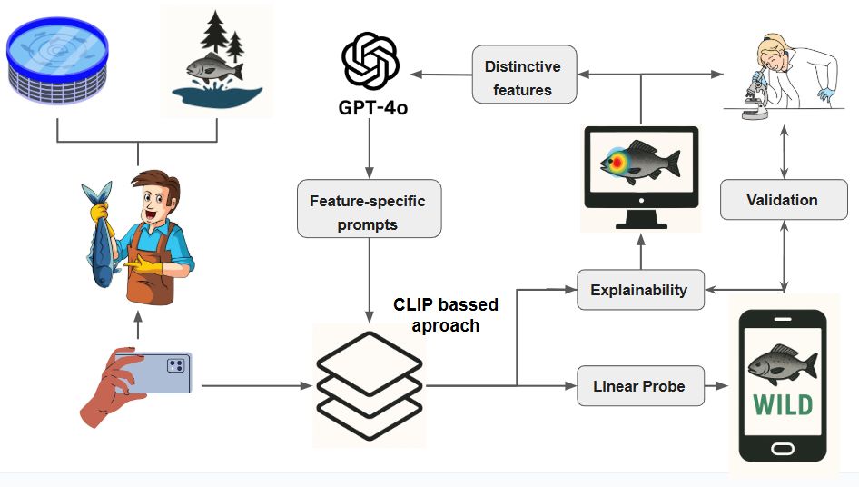

<h1 align="center">🐟 M1 && M1+: Benchmarking Deep Learning Models for Fish Classification with Explainability and Model Transparency 🔎</h1>
<h3 align="center">🌊 Tech4DLab GLORiA 🎣</h3>

<p align="center">
  
</p>

## 🎯 Abstract

Aquaculture is the fastest-growing food production
sector of this century. Although artificial intelligence has driven
numerous advancements in this field, no studies have focused
on the risks associated with fish escapes from aquaculture
farms. These events can cause environmental issues, disrupt
wild populations, compromise the health of other species and
negatively impact both aquaculture and traditional fisheries.
This work introduces an innovative approach to determining
the origin of two economically significant Mediterranean fish
species, Sparus aurata and Dicentrarchus labrax, using a CLIP-
based multimodal framework combined with a lightweight Linear
Probe classifier. By integrating expert-crafted textual descriptions
with visual embeddings, the proposed system achieves high
classification accuracy, outperforming traditional CNN and ViT
models, which require extensive pretraining. Additionally, the
methodology is validated with various explainability techniques,
including GRAD-ECLIP, expert-driven feature importance anal-
ysis and manual feature manipulation, ensuring a transparent
and interpretable system for aquaculture professionals. Eval-
uations conducted on wild, farmed and escaped fish and the
validation done demonstrate the model’s strong performance
and its potential to improve traceability and management in
aquaculture.

## 🧮 Architecture

<p align="center">
  
</p>

The proposed classification framework is based on the CLIP model, leveraging both textual descriptions and visual embeddings to distinguish between wild and farmed fish.  
The architecture of our approach follows these main components:

1. **Vision Encoder (ViT-B/16)**: The image of a fish is processed through a Vision Transformer encoder, generating a high-dimensional feature representation.
2. **Text Encoder (GPT Transformer)**: Expert-curated textual descriptions are encoded into a multimodal space using CLIP’s text encoder.
3. **Feature Aggregation**: Multiple textual embeddings (T₁, T₂, ..., Tₙ) are combined to refine the classification decision. Additionally, weighted feature vectors, *WF* (Wild Features) and *CF* (Cultivated Features), are computed as the average of image embeddings extracted from a training set.
4. **Cosine Similarity Computation**: The embeddings from the image, text encoders, and weighted features are compared using cosine similarity to determine the alignment between visual and textual features.
5. **Classification Methods**: The concatenated embedding (e.g., `I1T2`) is passed through different classifiers including **Linear Probe (LP)**, **k-Nearest Neighbors (KNN)**, **Random Forest (RF)**, and **Support Vector Machine (SVM)**.

---

## 💬 Prompts

**Main feature prompts and visual descriptions for *S. aurata* and *D. labrax*:**

## 💬 Prompts

**Main feature prompts and visual descriptions for *S. aurata* and *D. labrax*:**

| Species         | Feature            | Class (Color)            | Description                                                                                         |
|:---------------:|--------------------|--------------------------|----------------------------------------------------------------------------------------------|
|                 | Color              | Farmed (🔴 Red)          | A close-up of a fish with an outwardly curved lip line.                                             |
|                 |                    | Wild (🟣 Purple)         | A close-up of a fish with a neutral lip formation.                                                  |
|                 | Ventral Side       | Farmed (🔵 Blue)         | A close-up of a fish with a lateral line that lacks consistency in thickness and shape.            |
| **_S. aurata_** |                    | Wild (🟤 Brown)          | A close-up of a fish where the lateral line maintains a clean, distinct outline.                   |
|                 | Shape              | Farmed (🟢 Green)        | A close-up of a fish with an overall refined, smooth appearance enhanced by its fins.              |
|                 |                    | Wild (💗 Pink)           | A close-up of a fish with long, well-separated lateral fins aiding swift navigation.               |
|                 | Lateral Line/Fins  | Farmed (🟠 Orange)       | A close-up of a fish featuring a ventral region that starkly contrasts with its upper body.        |
|                 |                    | Wild (⚫ Gray)           | A close-up of a fish showcasing a smooth color gradient from grey to white with golden accents.    |
|-----------------|--------------------|--------------------------|-------------------------------------------------------------------------------------------|
|                 | Color              | Farmed (🔴 Red)          | A close-up of a fish featuring a naturally arched lip contour.                                     |
|                 |                    | Wild (🟣 Purple)         | A close-up of a fish displaying an uninterrupted, straight mouth structure.                        |
|                 | Shape              | Farmed (🔵 Blue)         | A close-up of a fish with an upper head contour that blends seamlessly into the lips.              |
| **_D. labrax_** |                    | Wild (🟤 Brown)          | A close-up of a fish displaying a dramatic forehead cut that ends abruptly at the lips.            |
|                 | Contour            | Farmed (🟢 Green)        | A close-up of a fish emphasizing minimalistic fins positioned close to its smooth surface.         |
|                 |                    | Wild (💗 Pink)           | A close-up of a fish with lateral fins extending freely and angling slightly outward.              |
|                 | Lateral Line       | Farmed (🟠 Orange)       | A close-up of a fish showcasing a broad, oval silhouette.                                           |
|                 |                    | Wild (⚫ Gray)           | A close-up of a fish whose streamlined straight shape is accompanied by a pointed snout.           |

---

## 📈 Performance

### 📜 CNNs vs Multimodal Models

| **CNN && ViT Models**     | Total (%) | *D. labrax* (%) | *S. aurata* (%) | **Multimodal Models** | Total (%) | *D. labrax* (%) | *S. aurata* (%) |
|---------------------------|-----------|------------------|------------------|------------------------|-----------|------------------|------------------|
| MobileNetV2               | 79.0      | 61.0             | 97.0             | BLIP                   | 55.0      | 50.0             | 60.0             |
| ResNet50                  | 80.5      | 74.0             | 87.0             | ALIGN                  | 56.5      | 74.0             | 39.0             |
| VGG                       | 84.0      | 78.0             | 90.0             | BLIP-2                 | 68.0      | 71.0             | 65.0             |
| **InceptionV3**           | **85.5**  | **74.0**         | **97.0**         | Kosmos-2               | 68.0      | 71.0             | 65.0             |
| ViT-L/14                  | 0.0       | 0.0              | 0.0              | OpenCLIP               | 84.0      | 74.0             | 94.0             |
| **ViT-B/32**              | **92.0**  | **87.0**         | **97.0**         | **CLIP**               | **86.5**  | **83.0**         | **90.0**         |
| ViT-B/16                  | 0.0       | 0.0              | 0.0              |

**🔎 Explanation:**  
Among CNNs, **InceptionV3** performs best, especially on *S. aurata*. However, **ViT-B/32** surpasses all CNNs with outstanding accuracy across both species. On the multimodal side, **CLIP** stands out, significantly outperforming other vision-language models. This confirms that integrating image and text improves fish classification performance, especially when paired with robust visual encoders like ViTs.

---

### 🥊 Selecting CLIP models: ViTs vs ResNets

| **ViT Models**      | Total (%) | *D. labrax* (%) | *S. aurata* (%) | **ResNet Variants** | Total (%) | *D. labrax* (%) | *S. aurata* (%) |
|---------------------|-----------|------------------|------------------|----------------------|-----------|------------------|------------------|
| **ViT-B/16**        | 86.5      | 83.0             | 90.0             | RN50                 | 84.0      | 87.0             | 81.0             |
| **ViT-B/32**        | 86.5      | 83.0             | 90.0             | RN101                | 74.0      | 87.0             | 61.0             |
| ViT-L/14            | 86.0      | 91.0             | 81.0             | RN50x4               | 63.5      | 30.0             | 97.0             |

**🔎 Explanation:**  
When used with CLIP, **ViTs** consistently outperform **ResNets**. Notably, **ViT-B/16** and **ViT-B/32** achieve balanced performance across species. **ViT-L/14** excels in *D. labrax* detection but is slightly weaker for *S. aurata*. Among ResNets, **RN50** is the most balanced, while **RN50x4** shows instability between classes—highlighting the robustness of transformer-based architectures.

---

### 🧪 Classifier Comparison (ViT Variants)

| **Model**       | Classifier | Total (%) | *D. labrax* (%) | *S. aurata* (%) |
|-----------------|------------|-----------|------------------|------------------|
| ViT-B/16 (~86M) | KNN        | 84.0      | 78.0             | 90.0             |
| ViT-B/16        | RF         | 84.0      | 78.0             | 90.0             |
| ViT-B/16        | **SVC**    | **93.5**  | **87.0**         | **100.0**        |
| ViT-B/16        | **LP**     | **93.5**  | **87.0**         | **100.0**        |
| ViT-B/32 (~86M) | KNN        | 84.0      | 74.0             | 94.0             |
| ViT-B/32        | RF         | 86.5      | 83.0             | 90.0             |
| ViT-B/32        | SVC        | 90.0      | 83.0             | 97.0             |
| ViT-B/32        | **LP**     | **92.0**  | **87.0**         | **97.0**         |
| ViT-L/14 (~304M)| KNN        | 90.5      | 87.0             | 94.0             |
| ViT-L/14        | RF         | 89.0      | 91.0             | 87.0             |
| ViT-L/14        | **SVC**    | **95.0**  | **96.0**         | **94.0**         |
| ViT-L/14        | LP         | 92.5      | 91.0             | 94.0             |

**🔎 Explanation:**  
Across all ViT variants, **SVC** and **Linear Probe (LP)** consistently outperform simpler classifiers like **KNN** and **Random Forest (RF)**.  
- For **ViT-B/16**, both SVC and LP reach **100% accuracy on *S. aurata*** and 93.5% overall.  
- **ViT-B/32** follows a similar trend, with LP achieving 92.0% overall.  
- The strongest results come from **ViT-L/14 + SVC**, reaching **95.0% total accuracy** with high precision for both species.  

These results confirm that ViT embeddings are highly expressive and benefit most from classifiers capable of leveraging complex feature spaces.


## 💡 Explainability


## 🔗 Reference

---

## 🗂️ Repository Organization

```bash
├── images/              # Visuals and figures used in the README
├── CNNs/                # Trained model checkpoints for CNN-based architectures
├── ViTs/                # Trained model checkpoints for Vision Transformers
├── CLIP/                # Trained model checkpoints for CLIP-based models
└── README.md            # This file


